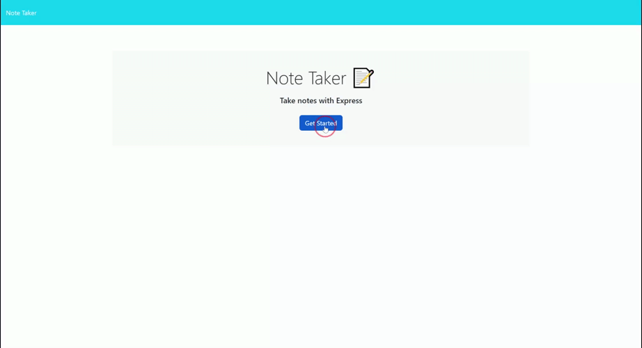

# NoteTakerApp

* SO THAT I can organize my thoughts and keep track of tasks I need to complete

Goal of the project is to create an application called Note Taker that can be used to write and save notes. This application will use an Express.js back end and will save and retrieve note data from a JSON file.

## Table of Contents

- [Installation](#installation)
- [Usage](#usage)
- [License](#license)
- [Questions](#questions)

## Installation

No installation needed see gif below for usage. 

## Usage

## License

This project is licensed under the MIT License. 

## Questions

If you have any questions, please contact me at [Github](https://github.com/mattscodingcorner) or via email at matt.j.velazquez@gmail.com.
    
    